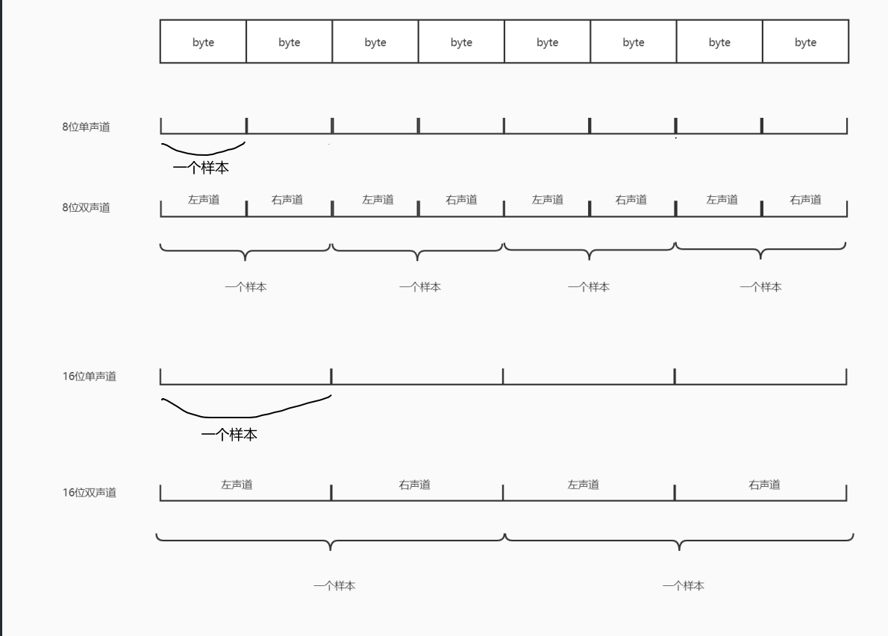

## 音频基础知识

### 采样-采样率-采样频率
- 采样是指将连续信号或数据在时间上进行离散化处理的过程。
- 采样频率则是指在单位时间内进行采样的次数。
- 采样率是指每秒钟采集到的样本数

**注**:采样频率也与采样率相关。采样率是指每秒钟采集到的样本数，通常以赫兹（`Hz`）或千赫兹（kHz）表示。采样频率等于采样率乘以通道数。例如，对于音频录制，采样率为`44.1 kHz`的`CD`质量音频，如果是双声道录制，则采样频率为`88.2 kHz`

### 采样位数/位宽
数字信号是用`0`和`1`来表示的。采样位数就是采样值用多少位`0`和`1`来表示，也叫采样精度，用的位数越多就越接近真实声音。如用`8`位表示，采样值取值范围就是`-128 ~ 127`，如用`16`位表示，采样值取值范围就是`-32768 ~ 32767`。


### 声道（channel）
- 单声道
- 双声道
- 多声道

### 编解码
通常把音频采样过程也叫做脉冲编码调制编码，即PCM（Pulse Code Modulation）编码，采样值也叫PCM值。 如果把采样值直接保存或者发送，会占用很大的存储空间。以16kHz采样率16位采样位数单声道为例，一秒钟就有16/8*16000 = 32000字节。为了节省保存空间或者发送流量，会对PCM值压缩。 

### 压缩
计算机应用中，能够达到最高保真水平的就是PCM编码。因此，PCM约定俗成了无损编码。PCM文件很大，所以需要压缩。

### 码率
码率 = 采样频率 * 采样位数 * 声道个数； 
例：采样频率`44.1KHz`，量化位数`16bit`，立体声(双声道)，`未压缩时的码率 = 44.1KHz * 16 * 2 = 1411.2Kbps = 176.4KBps`，即每秒要录制的资源大小,理论上码率和质量成正比

#### 常见码率           
- `800 bps` – 能够分辨的语音所需最低码率（需使用专用的`FS-1015`语音编解码器） 
- `8 kbps` —电话质量（使用语音编码） 
- `8-500 kbps` --`Ogg Vorbis和MPEG1 Player1/2/3`中使用的有损音频模式 
- `500 kbps–1.4 Mbps —44.1KHz`的无损音频，解码器为`FLAC Audio`,`WavPack`或`Monkey's Audio`
- `1411.2 - 2822.4 Kbps` —脉冲编码调制(`PCM`)声音格式CD光碟的数字音频                    
- `5644.8 kbps` —`SACD`使用的`Direct Stream Digital`格式

### 常用音频格式
- `WAV` 格式：音质高 无损格式 体积较大
- `AAC（Advanced Audio Coding）` 格式：相对于 `mp3`，`AAC` 格式的音质更佳，文件更小，有损压缩，一般苹果或者`Android SDK4.1.2（API 16）`及以上版本支持播放,性价比高
- `AMR` 格式：压缩比比较大，但相对其他的压缩格式质量比较差，多用于人声，通话录音

        `AMR`分类: `AMR(AMR-NB)`: 语音带宽范围：`300－3400Hz`，`8KHz`抽样 
            
- `mp3` 格式：特点 使用广泛， 有损压缩，牺牲了`12KHz`到`16KHz`高音频的音质

## `PCM`音频录制与播放

### `PCM`音频录制工具-`AudioRecord`

#### 录制权限
录音之前需要获取录音权限-`Manifest.permission.RECORD_AUDIO`
```java
if (ContextCompat.checkSelfPermission(this, Manifest.permission.RECORD_AUDIO) == PackageManager.PERMISSION_GRANTED) {

} else {
    ActivityCompat.requestPermissions(this, arrayOf(Manifest.permission.RECORD_AUDIO),
        RECORD_AUDIO_PERMISSION_REQUEST_CODE
    )
}
```

#### 参数
- 音频源（`Audio Source`）：通过`AudioRecord`，可以选择不同的音频源进行录制。
    1. `MediaRecorder.AudioSource.DEFAULT`：默认音频源，根据系统配置选择最适合的音频源。
    2. `MediaRecorder.AudioSource.CAMCORDER`：摄像头的音频源，用于录制与摄像机相关的音频。
    3. `MediaRecorder.AudioSource.VOICE_COMMUNICATION`：用于VoIP（Voice over IP）通话或网络语音聊天应用的音频源。
    4. `MediaRecorder.AudioSource.VOICE_DOWNLINK`：用于录制下行通话（即接收到的语音）的音频源。
    5. `MediaRecorder.AudioSource.VOICE_UPLINK`：用于录制上行通话（即发送的语音）的音频源。
    6. `MediaRecorder.AudioSource.VOICE_RECOGNITION`：用于语音识别应用的音频源，适用于长时间的语音输入。
    7. `MediaRecorder.AudioSource.CALL_ASSISTANT`：用于实时辅助通话的音频源。
</br>
- 采样率（Sample Rate）：可以设置音频数据的采样率，即每秒钟采集到的样本数。采样率影响音频数据的质量和频率范围。
    1. `8 kHz`: 这是电话音频的标准采样率，也是低质量音频的常见采样率。
    2. `16 kHz`: 这是语音识别和语音合成等应用常用的采样率。
    3. `44.1 kHz`: 这是音频CD的标准采样率，也是大多数音频文件（如MP3、WAV）的默认采样率。
    4. `48 kHz`: 这是专业音频设备和数字视频设备的常见采样率，也是DVD音频的标准采样率。
    5. `96 kHz`: 这是高保真音频系统和专业音频录制中常用的高采样率。
    6. `192 kHz`: 这是用于一些高端音频设备和音频处理的超高采样率。
</br>

- 音频通道（声道数）
    1. 单声道:`AudioFormat.CHANNEL_IN_MONO`
    2. 双声道:`AudioFormat.CHANNEL_IN_STEREO`
<br>

- 音频格式（Audio Format）：可以指定音频数据的格式，如PCM 16位、PCM 8位、PCM 浮点数等。PCM 16位是最常用的音频格式。
    1. `PCM 16`位:
    2. `PCM 8`位
<br>

- 缓冲区大小（`Buffer Size`）：需要设置一个合适的缓冲区大小来存储录制的音频数据。缓冲区大小取决于采样率和音频数据格式等参数
    ```java
    bufferSizeInBytes = AudioRecord.getMinBufferSize(
        采样率,
        通道,
        音频编码格式
    )
    ```

### 初始化`AudioRecorder`
```java
// 计算缓冲区大小
bufferSizeInBytes = AudioRecord.getMinBufferSize(
    config.sampleRateInHz,//采样率
    config.audioEncodingFormat.channelConfig,//通道
    config.audioEncodingFormat.audioFormat//音频编码
)

//根据采样数计算新的缓冲区,使缓冲区大小除以每个样本所占字节数为正数，并每帧的样本数整除
//假设：buffSizeInBytes = 1700
//config.audioEncodingFormat.bytesPreSimple = 2
//config.simplePreFrame = 160
var simpleSize = (bufferSizeInBytes / config.audioEncodingFormat.bytesPreSimple)//1700/2=850
if(simpleSize%config.simplePreFrame!=0){//850/160=5余50
    simpleSize += (config.simplePreFrame - simpleSize%config.simplePreFrame)//850+160-50=960，960/160=6,可以除尽
    bufferSizeInBytes = simpleSize * config.audioEncodingFormat.bytesPreSimple//
}

if (audioRecord == null) {
    audioRecord = AudioRecord(
        config.audioSource, config.sampleRateInHz,
        config.audioEncodingFormat.channelConfig, config.audioEncodingFormat.audioFormat, bufferSizeInBytes
    )
}
```
不同的音频编码和声道会导致PCM的一个样本所占的字节数不同的


-  所以如果想要将单声道音频转化到双声道则可以复制声道两遍

-  如果想要双声道音频转化到单声道则需要丢弃一个声道或者采取某种算法将两个声道数据合成

### 开始录制
由于`AudioRecorder`会一直在线程里录制音频然后输出到File中，所以为了不阻塞主线程，需要在子线程中进行整个录制过程
```java
override fun startPoolingAndWriting(
    audioRecord: AudioRecord,
    pullSizeInBytes: Int,
    outputStream: OutputStream
) {
    val audioChunk: AudioChunk = AudioChunk.Bytes(ByteArray(pullSizeInBytes))
    while (pull) {
        val count = audioRecord.read(audioChunk.toBytes(), 0, pullSizeInBytes)
        if (AudioRecord.ERROR_INVALID_OPERATION != count && AudioRecord.ERROR_BAD_VALUE != count) {
            postPullEvent(audioChunk) // 推送原始音频数据块
            outputStream.write(audioChunk.toBytes()) // 将数据写入文件
        }
    }
}

```
```java
private fun startRecord() {
    try {
        if (outputStream == null) {
            outputStream = FileOutputStream(file)
        }
        audioRecord!!.startRecording()
        pullTransport.isEnableToBePulled(true)
        pullTransport.startPoolingAndWriting((audioRecord)!!, bufferSizeInBytes, outputStream!!)
    } catch (e: IOException) {
        e.printStackTrace()
    }
}

executorService.submit { startRecord() }
```

### 暂停录制
从上面的代码中可以看到线程是在一个`while`循环中将数据写入`File`中,那么当我们跳出循环，则不会写入数据，就实现了暂停。
```java
override fun stopRecording() {
    pullTransport.isEnableToBePulled(false)

    if(recordState == MediaRecordState.STOP || recordState == MediaRecordState.IDLE){
        throw MediaRecordException("状态异常，此时录音机状态为:${recordState}")
    }
    recordState = MediaRecordState.STOP

    audioRecord!!.stop()
    notifyState()
}
```
**但是值得注意的是**,此时`AudioRecord`资源没有停止也没有释放，所以`AudioRecord`仍然在录制音频，其缓存区中还在不断刷新数据。`OutputStream`也没有关闭，如果在此时将`OutputStream`关闭释放，那么在恢复录制的时候将重新`New OutputStream`,届时File中的数据将不会往后填充，而是直接将之前的数据覆盖。

### 恢复录制
其实就是重新开始录制
```java
override fun resumeRecording() {
    initAudioRecord()

    if(recordState != MediaRecordState.PAUSE){
        throw MediaRecordException("状态异常，此时录音机状态为:${recordState}")
    }
    recordState = MediaRecordState.RECORDING

    executorService.submit { startRecord() }
}

private fun startRecord() {
    try {
        if (outputStream == null) {
            outputStream = FileOutputStream(file)
        }
        audioRecord!!.startRecording()
        pullTransport.isEnableToBePulled(true)
        pullTransport.startPoolingAndWriting((audioRecord)!!, bufferSizeInBytes, outputStream!!)
    } catch (e: IOException) {
        e.printStackTrace()
    }
}
```

### 停止
停止跟暂停差不多，只是需要把所有的资源释放掉
```java
override fun stopRecording() {
    pullTransport.isEnableToBePulled(false)

    if(recordState == MediaRecordState.STOP || recordState == MediaRecordState.IDLE){
        throw MediaRecordException("状态异常，此时录音机状态为:${recordState}")
    }
    recordState = MediaRecordState.STOP

    releaseResource()
}

private fun releaseResource(){
    if (audioRecord != null) {
        audioRecord!!.stop()
        audioRecord!!.release()
        audioRecord = null
    }
    if (outputStream != null) {
        try {
            outputStream!!.flush()
            outputStream!!.close()
            outputStream = null
        } catch (e: IOException) {
            e.printStackTrace()
        }
    }
}
```

### 播放`PCM`
`PCM`音频需要编码成其他常规音频格式才能使用`MediaPlayer`等音频播放器播放，但是原生的`PCM`音频可以使用`AudioTrack`。

#### 初始化`AudioTrack`
```java
/**
 * 初始化pcm播放组件
 */
private fun initAudioTrack() {
    bufferSizeInBytes =
        AudioTrack.getMinBufferSize(sampleRateInHz, channelConfig, audioFormat)
    audioTrack = AudioTrack(
        streamType,
        sampleRateInHz,
        channelConfig,
        audioFormat,
        bufferSizeInBytes,
        mod
    )
}
```
可以看到播放比录制多了两个参数。
- `streamType`(音频流格式)
    1. `AudioManager.STREAM_VOICE_CALL`：语音通话音频流，用于管理和控制与语音通话相关的音频。
    2. `AudioManager.STREAM_RING`：铃声音频流，用于管理和控制手机铃声的音频。
    3. `AudioManager.STREAM_NOTIFICATION`：通知音频流，用于管理和控制应用程序通知的音频。
    4. `AudioManager.STREAM_ALARM`：警报音频流，用于管理和控制闹钟和计时器的音频。
    5. `AudioManager.STREAM_SYSTEM`：系统音频流，用于管理和控制系统提示音、按键音等系统级音频。
    6. `AudioManager.STREAM_DTMF`：DTMF音频流，用于管理和控制来自电话键盘的音频（如拨号音）。
<br>

- `mod`(播放模式)
    1. `AudioTrack.MODE_STREAM`：流模式，用于播放动态生成或实时接收的音频数据。在该模式下，音频数据通过缓冲区逐帧写入，可以实现实时的音频播放。
    2. `AudioTrack.MODE_STATIC`：静态模式，用于播放预先加载的音频数据。在该模式下，音频数据一次性写入缓冲区，适用于播放完整的音频文件或音频片段。
    3. `AudioTrack.MODE_STATIC`和`AudioTrack.MODE_STREAM`的区别在于数据的加载方式和处理方式。静态模式适用于一次性加载并播放完整的音频数据，而流模式适用于实时生成或接收音频数据的播放。
    3. `AudioTrack.MODE_STATIC_SYNC`：静态同步模式，类似于静态模式，但在开始播放之前需要调用`AudioTrack.play()`方法。
    4. `AudioTrack.MODE_INVALID`：无效模式，表示未初始化的或无效的`AudioTrack`实例。

#### 播放
需要将`File`中的数据输入`AudioTrack`中，文件读写是耗时的操作，所以也会在子线程中进行
```java
private fun play() {
    if (audioTrack == null || fileInputStream == null) {
        return
    }
    val data = ByteArray(bufferSizeInBytes)
    audioTrack!!.play()
    while (true) {
        if (isStopPlay) {
            release()
            break
        }
        var readSize = -1
        try {
            readSize = fileInputStream!!.read(data)
        } catch (e: IOException) {
            e.printStackTrace()
        }
        if (readSize <= 0) {
            isStopPlay = true
            playerStop.invoke(true)
            continue
        }
        audioTrack!!.write(data, 0, readSize)
    }
}
```

#### 停止播放
停止播放只需要将子线程中的死循环break出来，然后释放资源。
```java
/**
 * 停止播放
 */
fun stopPlay() {
    isStopPlay = true
    try {
        join(2000)
    } catch (e: InterruptedException) {
        e.printStackTrace()
    }
}

/**
 * 释放资源
 */
private fun release() {
    if (audioTrack != null) {
        audioTrack!!.stop()
        audioTrack!!.release()
        audioTrack = null
    }
    if (fileInputStream != null) {
        try {
            fileInputStream!!.close()
        } catch (e: IOException) {
            e.printStackTrace()
        }
    }
}
```


## 参考文献:
[Android音频开发（1）：音频基础知识](https://juejin.cn/post/6844903654252609543)
[Android音视频系列（七）：PCM音频单声道与双声道的相互转换](https://blog.csdn.net/u011315960/article/details/105678937)


